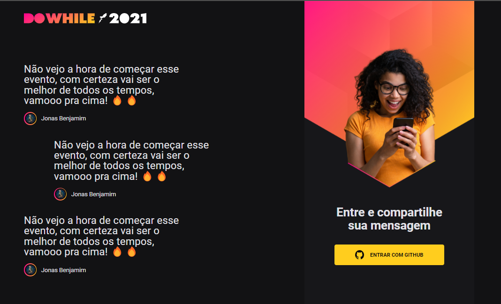

# DoWhile

## DoWihile RocketSeat

O Projeto é um desafio da RockeSeat para testar e aprimorar conhecimentos em React com Typescript

 Você pode ver uma demonstrançao do projeto <a href="https://whiledo.netlify.app/"> aqui! <a/>
	
# 
	

<h4 align="center"> 
	🚧 🚀 Porjeto Finalizado...  🚧
  </h4>

 <a href="#objetivo">Objetivo</a> • 
 <a href="#tecnologias">Tecnologias</a> •  
 <a href="#autor">Autor</a>

  
  ## Objetivo 
  
  #### Testar e aprimorar React e Typscript.
  
  ## Tecnologias
  
  #### React, Sass, Typescript.
  
  ## Autor
  
  #### Jonas Benjamim
  
